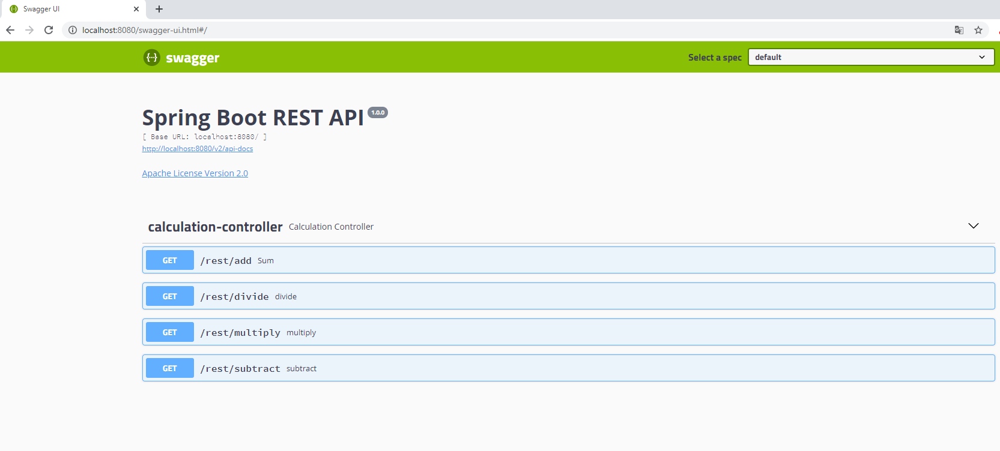

## Overview

This project implements a REST interface adapter to the SOAP interface to perform simple arithmetic operations

## Deployment

This project can be deployed by standalone Spring-Boot container

If you want to run the project from the Idea, you should first compile the jar with the package command to automatically generate classes based on the wsdl

## Swagger UI

A [Swagger User Interface](http://swagger.io/swagger-ui/) is available within project application to view and invoke the available services. http://localhost:8080/swagger-ui.html  This should display the below Swagger interface:

